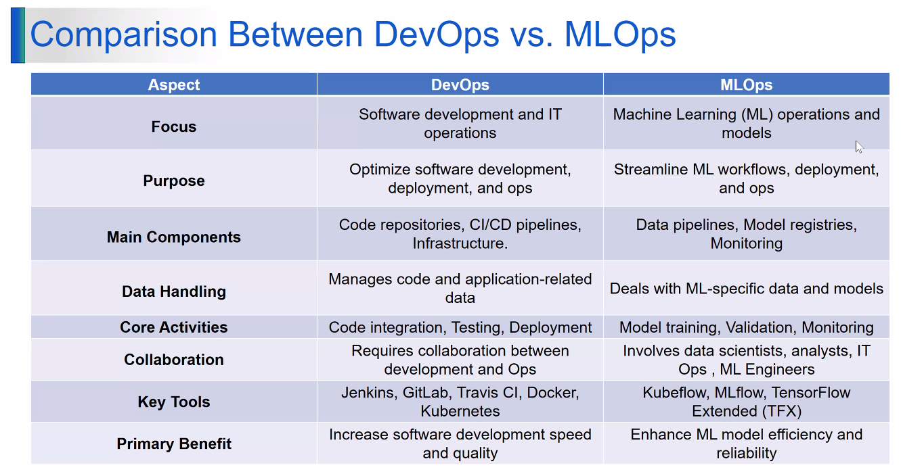

# 🧠 MLOps Essentials

Main goal of **MLOps** is to **operationalize ML models** — i.e., take already-developed algorithms, **train, deploy, manage, monitor, and continuously improve** them in production.  
It brings together **Data Science + DevOps** practices.

---

## ⚙️ Steps of MLOps

### **1. Exploratory Data Analysis (EDA)**
- Gather and understand raw data  
- Identify missing values, outliers, data types  
- Visualize data patterns & correlations  

---

### **2. Data Pre-processing & Feature Engineering**
- Clean, normalize, and encode the data  
- Select key features that impact prediction  
- Create new derived features if needed  

---

### **3. Model Training & Hyperparameter Tuning**
- Choose the right algorithm (e.g., regression, tree-based, NN)  
- Split data (train/test/validation)  
- Tune hyperparameters to optimize performance  

---

### **4. Model Review & Governance**
- Validate accuracy, precision, recall, F1-score, etc.  
- Ensure model transparency, explainability, and compliance  
- Document model version, data source, metrics  

---

### **5. Model Inferencing & Serving**
- Test predictions on unseen (real-world) data  
- Serve models via REST API, batch jobs, or streaming pipeline  
- Validate latency and accuracy under load  

---

### **6. Model Deployment & Monitoring**
- Deploy using CI/CD pipelines (similar to DevOps)  
- Monitor drift, performance degradation, and resource usage  
- Set up alerts for anomaly detection  

---

### **7. Automated Model Retraining**
- Periodically retrain model with latest data  
- Automate via pipelines (Kubeflow, MLflow, Airflow, Vertex AI)  
- Version and redeploy updated model  

---

## 🔁 DevOps vs MLOps

| Aspect | DevOps | MLOps |
|--------|---------|--------|
| **Focus** | Application code & infra | Model lifecycle & data |
| **Pipeline** | Code → Build → Test → Deploy | Data → Train → Validate → Deploy |
| **Artifact** | Executable/service | Trained model |
| **Versioning** | Source code | Data + Model + Metrics |
| **Monitoring** | App uptime | Model drift & prediction accuracy |
| **Tools** | Jenkins, Docker, Kubernetes | MLflow, Kubeflow, Airflow, Vertex AI |

---

🧩 *Goal:* Make ML model delivery **repeatable, reliable, and automated** just like software delivery in DevOps.

---

